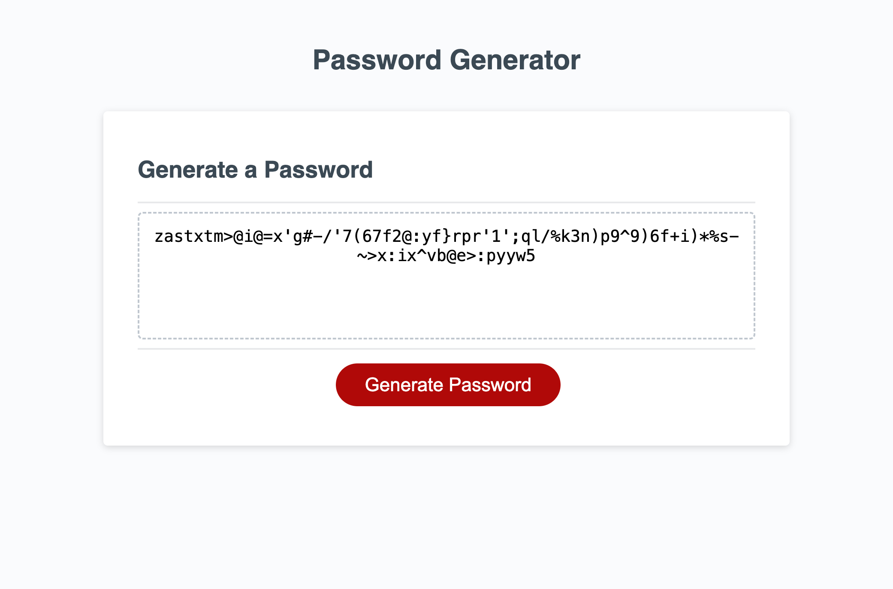

# Password Generator

## Description

This project was created so that the user can generate a random password meeting their chosen criteria. The user can choose whether or not the randomly generated password can include lowercase letters, uppercase letters, numbers, and/or special characters, as well as the length of the password given it's within a certain range. In building this application, I learned how to use confirm, prompt, and alert functions. I gained a better understanding of for loops, and I learned how to use Math.random to generate random numbers.

[Deployed Website](https://caseynewman.github.io/password-generator/)

## Usage

As a user, click 'Generate Password' to begin. You'll be asked to click OK to confirm if you'd like to include special characters, numbers, uppercase letters, and lowercase letters. After making your selections, you'll be asked how many characters you would like your password to be. Note that it must be between 8 and 128 characters in length. You'll then be presented with a randomly generated password matching your criteria.

## Credits

- [Math.random](https://developer.mozilla.org/en-US/docs/Web/JavaScript/Reference/Global_Objects/Math/random)
- I worked with a tutor, Alexis San Javier, to help consolidate the if statements I had written for each possible combination by using an empty string for the character pool.